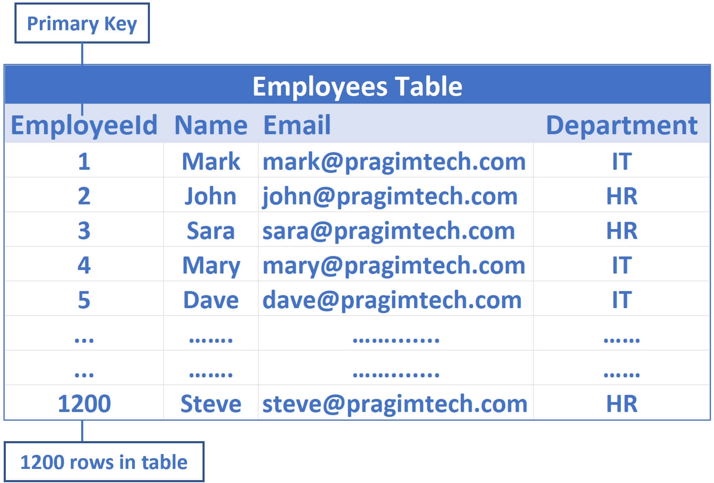
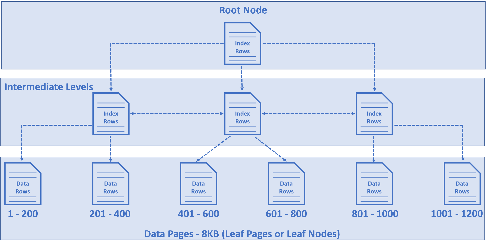
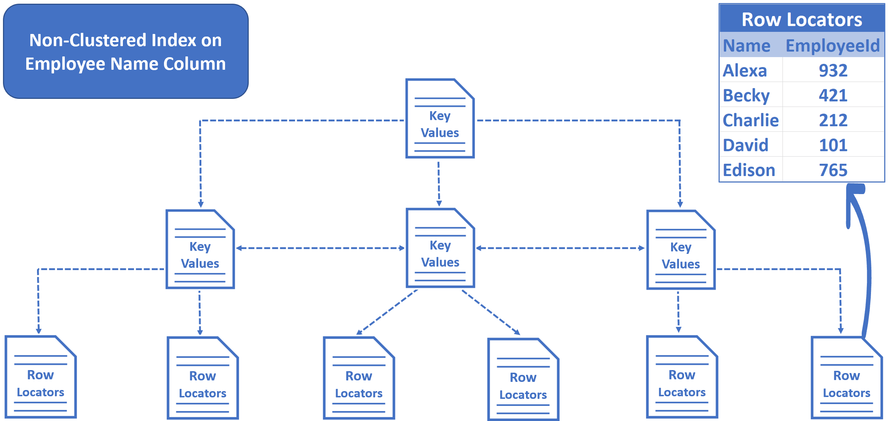
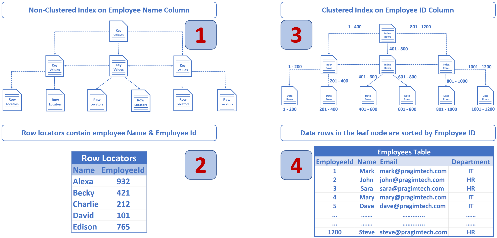

# Index 작동방식

>Author: 백승화  
>Created: 2021년 8월 7일 오후 4:48  
>Tags: Index, RelationalDB

## Clustered Index

위와 같은 테이블이 존재한다고 했을 때 Primary key를 기준으로 클러스터드 인덱스를 생성하게 된다

그리고 오른쪽의 그림처럼 트리를 구성해서 데이터를 저장하게 된다

### 클러스터드 인덱스를 사용한 select

아이디 값을 클러스터드 인덱스로 사용할 경우에 아이디 값을 기준으로 select 연산을 할 때 유리하게 연산을 할 수 있다

예를 들어서 `Select * from Employees where Id = 932000` 이런 연산이 있다고 한다면

- Number of rows read = 1
- Actual number of rows for all executions = 1

의 형태로 연산이 실행된다

굉장히 효율적으로 연산을 할 수 있다는 것이다

### 클러스터드 인덱스를 사용하지 않은 select

`Select * from Employees Where Name = 'ABC 932000'` 이런식의 연산을 진행한다면

이름에는 아무런 인덱스 설정이 되어져 있지 않기 때문에 연산을 Clustered Index Scan을 진행하게 되지만 사실상 모든 테이블을 방문하는 완전탐색 방식으로 연산을 하게 된다

백만개의 데이터가 있다고 가정을 한다면

- Number of rows read = 1,000,000
- Actual number of rows for all executions = 1

이런 경우에는 인덱스 연산은 맞지만 성능은 좋지 않다는 것을 확인 할 수 있다

## Non Clustered Index

위의 그림은 Name을 Non clustered Index를 설정했을 경우에 생성되는 것이다

그러므로 Non clustered index를 사용하게 된다면 추가적인 공간이 필요하다

왜냐하면 위에 그림에서 보듯이 leaf node에서 실제 데이터를 가지고 있는 것이 아니라 non clustered index 지정 칼럼과 clustered index의 값이 같이 들어가서 저장되어 있기 때문이다

그래서 Name 이외에 추가적인 데이터를 얻기 위해서는 클러스터드 인덱스로 정렬 되어져 있는 곳에 가서 한번 더 찾아야 한다

`Select * from Employees Where Name = 'ABC 932000'` 위와 같은 쿼리를 실행한다면 아래와 같은 순서로 동작하게 된다

하지만 `Select Name, ID from Employees Where Name = 'ABC 932000'`  위와 같은 쿼리를 실행하게 된다면 Name, ID 값은 Non clustered Index만 가지고도 찾을 수 있는 값이기 때문에 추가적인 Clustered Index 탐색이 필요없다

## 참고

[How do sql indexes work](https://www.pragimtech.com/blog/sql-optimization/how-do-sql-indexes-work/)

[MySQL :: MySQL 5.7 Reference Manual :: 14.6.2.1 Clustered and Secondary Indexes](https://dev.mysql.com/doc/refman/5.7/en/innodb-index-types.html)