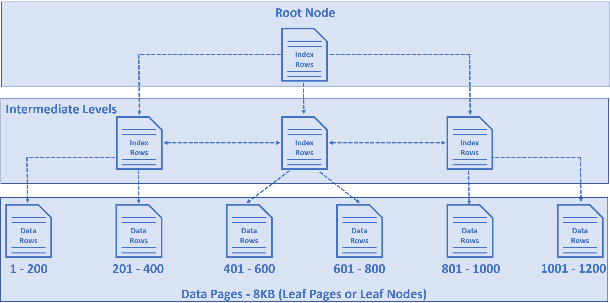

# SQL에서 데이터 저장 방식

Author: 백승화
Created: 2021년 8월 7일 오후 3:53
Tags: Index, RelationalDB

## 데이터 저장 단위

SQL 서버에서는 우리가 테이블로 저장한 데이터 튜플들을 실제로는 Data Page(보통 8kb의 크기를 가짐)에 저장한다

`data page` : 물리적으로 데이터가 저장되는 data storage의 기본 단위이다

## 데이터 저장 방식

데이터를 우리가 저장할 때는 트리 형태로 데이터를 저장하게 되는데

이것을 b-tree, index b-tree, clustered index structure 이렇게 부르는데 3개다 같은 이야기다

위에 그림에서 볼 수 있듯이

- `Root Node` : 인덱스의 범위를 총체적으로 가지고 있는 노드
- `Intermediate levels` : leaf node에 도달하기 위한 인덱스 범위에 위치에 대한 포인터를 가지고 있다
- `Data pages` : leaf node로써 실제 튜플들을 8KB 만큼 저장해서 보관하는 공간이다

3가지로 나눠서 트리를 생성하게 된다

### 클러스터드 인덱스를 설정하지 않았는 경우 (Mysql - InnoDB 기준)

보통은 primary key를 기본적으로 사용하여서 클러스터드 인덱스를 설정한다

primary key가 존재하지 않는 경우 첫번째로 설정된 Unique index(Not Null)를 가지고 클러스터드 인덱스를 생성한다

둘다 존재하지 않는 경우 GEN_CLUST_INDEX 라는 히든 칼럼을 생성해서 이것을 가지고 클러스터드 인덱스를 생성해서 기본적으로 데이터를 저장하게 된다

## 데이터 찾는 방식

### 클러스터드 인덱스를 이용해 찾는 방법

위의 그림처럼 인덱스가 포함되는 범위의 포인터를 타고 계속해서 들어감으로써 데이터를 빠르게 찾을 수 있도록 보장한다

단 `select * from [table name] where employeeId = 1120` 이런식으로 클러스터드 인덱스를 기준으로 찾을 때를 이야기하는 것이다

### 클러스터드 인덱스가 아닌 경우

클러스터드 인덱스가 아닌 컬럼을 기준으로 데이터를 찾는 경우 테이블을 완전 탐색을 통해서 데이터를 찾는 방식으로 찾을 수 밖에 없다

하지만 완전 탐색을 통해서 데이터를 찾는 경우에는 성능면에서 굉장히 비효율적이라는 것을 알 수 있다

그래서 우리는 이것을 해결하기 위해서 `non clustered index`를 생성해서 사용할 것을 고려할 수 있다

## 참고

[How is data stored in SQL database](https://www.pragimtech.com/blog/sql-optimization/how-is-data-stored-in-sql-database/)

[MySQL :: MySQL 5.7 Reference Manual :: 14.6.2.1 Clustered and Secondary Indexes](https://dev.mysql.com/doc/refman/5.7/en/innodb-index-types.html)