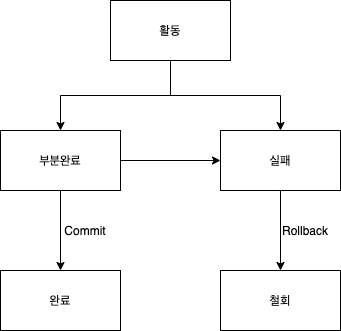

# 트랜잭션
데이터베이스는 다수의 사용자가 동시에 사용하더라도 항상 모순이 없는 데이터를 제공해야한다  
장애가 생기더라도 원래상태로 복구가 가능해야한다  
모순이 없는 데이터를 제공하고 장애를 복구하는 기능들의 중심에 있는 트랜젝션에 대해서 알아보자  

## 트랜잭션이란...
하나의 작업을 수행하는 데 필요한 데이터베이스의 연산들을 모아놓은 것이다  
- 데이터베이스에서 논리적인 작업의 단위  
- 데이터를 복구하는 작업의 단위  

쉽게 말해서 작업 수행에 필요한 SQL문의 모임이라고도 볼 수 있다  
**트랜잭션은 모든 명령문이 완벽하게 처리되거나 하나도 처리되지 않아야 한다**  

### 예시
A가 은행에서 B로 5000천원을 계좌이체한다고 예시를 들어보겠다  
1. A계좌에서 5000원을 빼는 UPDATE
2. B계좌에 5000원을 더하는 UPDATE

계좌이체를 하기위해서 총 2번의 SQL문을 실행시켜야한다  
이 2번의 연산이 하나의 트랜젝션으로 볼 수 있는 것이다   

--------------------------------

## 트랜잭션의 특성  
### 원자성 (Atomicity)
연산들이 모두 정상적으로 실행되거나 하나도 실행되지 않아야 한다는 것을 의미한다  
트랜잭션의 원자성을 보장하기 위해서는 복구하는 회복기능이 필요하다

### 일관성 (Consistency)
트랜잭션이 성공적으로 수행된 후에도 데이터베이스가 일관된 상태를 유지해야한다는 것을 의미한다  
단 연산 도중에는 일관성이 깨질수도 있다  

### 격리성 (Isolation)
현재 수행중인 트랜잭션이 완료될 때까지 트랜잭션이 생성한 중간 연산 결과에 다른 트랜잭션들이 접근할 수 없음을 의미한다  
물론 한번에 하나의 트랜잭션만 수행되는 DBMS라면 이런것이 필요없을 수 도 있다  
하지만 보통 DBMS들은 여러개의 트랜잭션을 동시에 처리하기 때문에 이러한 속성이 필요하다  
운영체제에서의 멀티쓰레딩할때 동기화하는 것과 비슷한것 같다  

### 지속성 또는 영속성 (Durability)
트랜잭션이 성공적으로 완료된 후 데이터베이스에 반영한 수행결과는 어떠한 경우에도 손실되지 않고 영구적이어야 한다  

### 트랜잭션 특성을 지원하는 DBMS기능
|트랜잭션 특성|DBMS의 기능|
|---|---|
|원자성|회복 기능|
|일관성|병행 제어 기능|
|격리성|병행 제어 기능|
|지속성|회복 기능|
-----------

## 트랜잭션의 연산
트랜잭션의 수행과 관련해서 사용되는 연산에는 commit과 rollback 연산이 있다
### commit
트랜잭션의 수행이 성공적으로 완료되었음을 선언하는 연산이다  
이 연산이 선언된 후에야 데이터베이스에 수행결과가 반영된다

### rollback
트랜잭션의 수행이 실패했음을 선언하는 연산이다  
이 연산이 수행되면 지금까지 실행한 연산의 결과가 취소되고 원래의 상태로 돌아간다  

### 트랜잭션의 상태
  

- `활동 상태` : 트랜젝션이 시작부터 수행중인 상태를 나타낸다
- `부분완료 상태` : 마지막 연산이 실행된 직후의 상태
- `완료 상태` : commit 연산을 실행한 상태
- `실패 상태` : 장애가 발생하여 트랜잭션의 수행이 중단된 상태
- `철회 상태` : rollback 연산을 실행한 상태
  - `트랜잭션을 다시 실행` : 하드웨어, 소프트웨어 문제
  - `트랜잭션 폐기` : 데이터가 데이터베이스에 없거나 논리적인 오류가 있는 경우