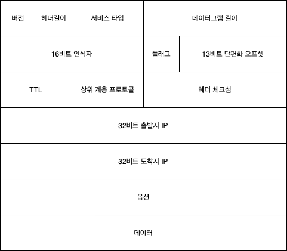

#IPv4
>Author: 백승화  
>Created: 2021년 10월 7일  
>Tags: `IP`

## IPv4 헤더 구조

- 버전 : IPv6인지 IPv4인지 입력하는 공간이다
- 헤더길이 : 헤더길이 + 옵션을 포함한 값이다
- 서비스 타입 : 다른 유형의 IP 데이터그램을 구분하는데 사용
- 데이터그램 길이 : 전체 데이터그램 길이이다 헤더 + 데이터
- 인식자, 플래그, 오프셋 : 단편화에 필요한 헤더들이다
- TTL : 네트워크에서 무한히 존재하지 않도록 하나의 홉을 지날때마다 수명이 줄어들어서 0이되면 사라진다
- 프로토콜 : 상위계층에 뭘 사용했는지

## 단편화 (fragment)
MTU(Maximum Transmission Unit)이 각 링크 계층마다 존재하는데  
네트워크 계층에서 만들어진 데이터그램은 MTU의 크기를 넘어서 링크 계층으로 전달하지 못한다  
그러므로 데이터그램을 전달 할 수 있는 크기로 나누는것을 단편화라고 한다  

### 단편화의 필수요소
- `식별번호` : 네트워크 계층에서 데이터그램을 내보낼때마다 식별번호의 값을 증가시킨다  
    같은 식별번호를 가지면 해당 데이터그램은 같은 데이터그램이라는 것을 파악할 수 있다
- `플래그` : 단편화를 하게되면 어디가 마지막 패킷인지를 알아야하기 때문에 마지막 패킷은 0을 가지고 나머지는 1을 가진다  

- `단편화 오프셋` : 단편화를 하게되면 순서를 맞춰야하기 때문에 오프셋을 가지고 위치를 찾을 수 있게 해준다  

### 재결합의 위치
네트워크 계층에서 단편화가 이루어지지만 그렇다고 모든 네트워크 라우터에서 재결합을 하면 성능의 문제가 생김으로  
종단 시스템에서 재결합하기로 했다  

## 주소체계

### 서브넷
- `정의` : 호스트들의 인터페이스와 연결된 라우터의 인터페이스와 연결된 네트워크를 서브넷이라고 부른다  
        호스트 대신에 라우터의 인터페이스와 라우터 인터페이스랑 연결된 것도 서브넷을 구성할 수 있다
  
- `서브넷 마스크` : ip주소에서 1.1.1.1/24 이렇게 /x 로 표현한 것들이 있는데 여기서는 /24라고 선언했는데  
    앞에서 부터 24비트는 서브넷의 주소를 표현하는데 사용되는데 이것을 가리키는 말이다  
  
### 클래스 주소체계
현재에는 사용하지 않지만 초기에 서브넷 주소를 할당해주기 위해서 사용했던 방식으로  
IP주소의 서브넷 마스크의 크기를 8, 16, 24로 할당하였다  
  
**문제점**  
서브넷 마스크가 24인 경우(c 클래스)에는 실제로 호스트에게 할당해줄 수 있는게 254개로 한정되어져있고  
서브넷 마스크가 16인 경우(b 클래스)에는 실제로 호스트에게 할당해줄 수 있는게 65634개로 한정되어져 있다  
즉 호스트를 300명인 회사에서는 c클래스 보다는 크지만 b클래스를 할당받으면 너무 많은 주소 공간이 낭비된다는 단점이 존재했다

### CIDR
클래스 주소체계와는 다른 방식을 채택하고 있다  
클래스 주소체계에서는 A,B,C 클래스로 구분함으로써 강제적으로 서브넷의 범위를 지정해줬다면  
CIDR에서는 a.b.c.d/x 에서 x비트 까지는 서브넷 32-x는 내부 장치에 할당해줄 주소를 가리킨다  
클래스 주소체계에 비해서 훨씬 효율적으로 ip주소를 사용할 수 있다  

### DHCP
Dynamic Host Configuration Protocol의 약자로써   
새로운 호스트가 특정 기업의 네트워크 공간에 진입하고자 할 때  
호스트에게 동적으로 ip주소, 서브넷 마스크, 홉라우터 주소 로컬 DNS 서버 주소를 할당해주는 것을 이야기한다  

**작동순서**  
1. DHCP 서버 발견  
   새로 온 호스트는 DHCP 서버를 발견하기 위해서 67번 포트로 브로드캐스팅을 시도한다
2. DHCP 서버 제공  
   요청을 받은 서버들은 (트랜잭션 ID, IP주소 임대기간, IP주소)메세지를 브로드캐스팅한다 
3. DHCP 요청  
   호스트는 여러 조건중에서 가장 괜찮은 것을 사용해서 연결하겠다고 해당 서버로 요청을 보낸다  
4. DHCP ACK  
DHCP 서버는 ACK 응답을 보냄으로 알았다고 응답한다  
   

## NAT