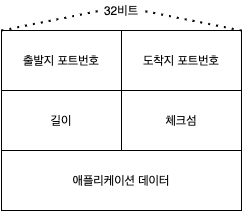

# UDP
>Author: 백승화  
>Created: 2021년 9월 30일  
>Tags: `udp`

## UDP란..
비연결지향형 트랜스포트 계층 프로토콜이다  
UDP는 트랜스포트 계층 프로토콜이 할 수 있는 최소기능으로 동작한다  
다중화/역다중화, 간단한 오류 검사 기능을 제공한다  

**비연결형인 이유**
- 수신측과 송신측의 트랜스포트 계층에서 핸드셰이크를 통한 연결성을 생성하지 않기 때문이다

### 특징
**장점**
- 동일한 목적지 IP와 목적지 포트번호를 가지면 하나의 소켓으로 다 들어간다
- 무슨 데이터를 언제 보낼지에 대해 애플리케이션 레벨에서 더 정교한 제어가 가능
- 연결 설정이 없다
- 연결 상태가 없다
- 작은 패킷 헤더 오버헤드

**단점**
- 송신자 수신자 간의 높은 손실율을 초래할 수 있다
- TCP 세션이 줄어들 수 도 있다

### UDP checksum
UDP에서는 자체적으로 하위에서 계층에서 받은 세그먼트가 오류가 있는지 체크하는 checksum 필드를 가지고 있다  
오류 검출은 하지만 오류가 발생했을 때 별다른 조치를 취하지는 않는다  
**checksum 방법**  
1. 세그먼트를 16비트씩 나눈다
2. 16비트씩 나눈 것을 다 더한다
3. 오버플로우가 발생하는 경우 윤회식 자리올림을 한다
4. 결과값을 1의 보수(반전)을 취한다

### 대표적인 사용사례
- DNS 서버
- 실시간 스트리밍 서비스 서버

## UDP 세그먼트 구조

- 길이 : 헤더를 포함한 udp 세그먼트의 길이
- 체크섬 : 오류가 발생했는지 확인하기 위해 있는 필드

