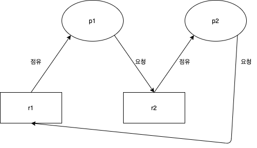

# 데드락

## 데드락 이란...
다중 프로그래밍 시스템에서 프로세스가 결코 일어나지 않을 이벤트를 기다리는 상태가 되면 데드락 상태에 빠졌다고 한다  
좀 더 쉽게 이해하기 위해p1이라는 프로세스와 p2라는 프로세스와 자원 R1과 R2가 있다고 가정하겠습니다  

위에 그림을 보시면 아시겠지만  
p1은 r1을 점유중(락걸린상태) p2는 r2를 점유중 하지만 여기서 p1이 r2에 자원을 요청 p2가 r1에 자원을 요청  
이런 상태가 되어버리면 서로서로 락을 걸린 자원에 요청을 하기 때문에 절대로 일어나지 않을 상황에 놓이게 되었습니다  
이런 상태를 보면 데드락 상태라고 보면 됩니다  

## 데드락 발생 조건 4가지
1. Mutual Exclusion  
    모두가 공유상태의 자원을 가진다면 발생하지 않지만 한 자원이라도 비공유 자원형태를 가진다면  
      상호배제를 실행해야 하기에 데드락이 발생할 수 있다
2. Hold and Wait  
   한 프로세스가 자원을 잡고 있으면서 방출하지 않고 다른 프로세스가 점유중인 다른 자원을 요청할 경우 발생한다
3. No Preemption  
   만약 프로세스가 비선점형 방식이라면 발생할 수 있다
4. Circular Wait  
   의존형 그래프가 순환 참조가 되어버리는 순간 발생하게 된다

## 해결 방법

### 교착 상태 예방

교착 상태를 유발하는 4가지 조건이 발생하지 않도록 무력화하는 방식이다

매우 이상적인 이야기이지만 실제로 이대로 하기가 사실상 불가능 하다

### 교착 상태 회피

자원 할당량을 조절하여서 교착상태를 해결하는 방식이다

- 은행원 알고리즘

  최악의 경우를 기준으로 함으로써 문제 상황을 철저히 피하는 것을 이야기한다

- 문제점
    - 프로세스가 자신이 사용할 모든 자원을 미리 선언해야 한다
    - 시스템의 전체 자원 수가 고정적이어야 한다
    - 자원이 낭비된다

### 교착 상태 검출과 회복

교착 상태 검출은 운영체제가 시스템에서 교착 상태가 발생하지 안하는지 계속해서 주시하는 것을 이야기한다

- 타임아웃 검출 방법

  일정 시간 동안 작업이 진행되지 않는 프로세스를 교착상태에 빠졌다고 판단하고 처리하는 방법이다

    - 장점
        - 자원 할당 그래프에 비해서 구현해야할 부분이 적다
    - 단점
        - 일정 시간 동안 작업이 진행되지 않는건 맞지만 교착 상태가 원인이 아닌 프로세스를 종료 할 수 도 있다
        - 모든 시스템에 적용 할 수 없다
- 자원 할당 그래프 검출 방법

  특정 자원이 어디에 할당 되어져 있고 특정 자원을 다음엔 어디로 할당해줘야 하는지 같은 것들이 나와져 있는 방향성 그래프이다

    - 교착 상태 검출 방법

      그래프에서 싸이클이 발생하였다면 현재 교착 상태라는 것을 알 수 있다

- 회복 방법
    - 교착 상태를 일으킨 모든 프로세스 종료
    - 교착 상태를 일으킨 프로세스들을 차례대로 하나씩 종료하면서 상황을 지켜본다
        - 우선순위가 낮고 else if 낮고 같다면 작업이 짧은 경우 else 자원을 많이 사용하는 것 먼저

